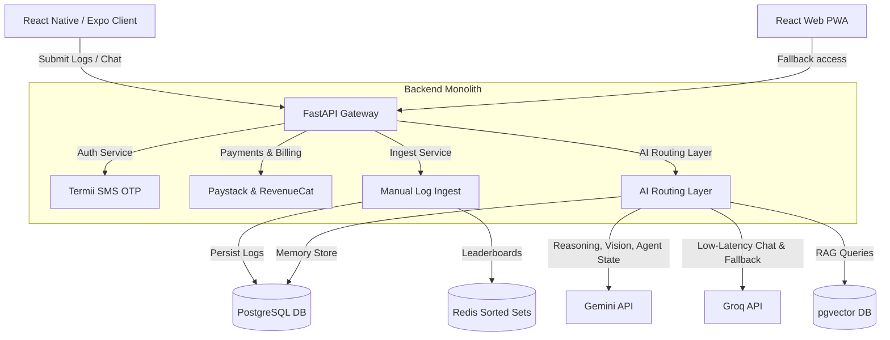

# FitNaija: Architecture Analysis, Implementation Steps, & Roadmap

This document outlines the system architecture, technical specifications, and implementation roadmap for **FitNaija**—a dual-platform (Web + Mobile App) fitness challenge prototype. The architecture is locked and finalized around compliance, Gemini + Groq AI routing, custom location taxonomies, manual payouts, and safe, non-health-sensitive telemetry.

---

## 1. System Architecture Summary

The platform uses a modular monolith backend running FastAPI, communicating with a React Native (Expo) mobile client and a React Vite PWA fallback. It enforces the following requirements:
*   **App Store & Play Store Compliance:** No integration of Apple HealthKit, Google Fit REST APIs, or biometrics. Telemetry is user-submitted (forms containing workout type, duration, distance, and estimated steps) with optional proof images.
*   **Gemini + Groq AI Routing:** Integrates:
    *   **Google Gemini (Gemini Flash/Pro):** Primary reasoning engine, Vision OCR parser of workout screenshots, and agent state planner.
    *   **Groq:** Low-latency inference for real-time conversational chat streams and primary system fallback layer.
    *   *OpenAI is completely removed.*
*   **Target Location Taxonomy:** A DB enum enforces location scopes for challenges, users, and content (Abuja neighborhoods: Maitama, Wuse, Garki, Asokoro, Apo, Lokogoma, Guzape, Lugbe, Kubwa; and extended regions: Lagos, Port Harcourt).
*   **Onboarding & Pricing:** 1-month free trial (`trial_active`), transitioning to a **₦15,000/month** recurring subscription via Paystack checkout. Onboarding is structured around value activation milestones before any billing screen.
*   **Manual-Only Payouts:** Fully manual payout processes via CSV ledger export; no direct financial payout automation.
*   **Deployment Setup:** The FastAPI backend, Celery background workers, Redis caches, and PostgreSQL databases are deployed on **Render** (using a unified `render.yaml` configuration). The static Vite PWA web app is deployed on **Netlify** (using `netlify.toml`).



---

## 2. AI System Architecture (RAG + Agents + Memory)

The AI layer relies on a unified model routing layer to maintain compatibility with LangGraph and RAG workflows:

```
                         [User Message Input]
                                  │
                                  ▼
                       [LangGraph Router Node]
                                  │
                 ┌────────────────┴────────────────┐
                 ▼                                 ▼
          [AI Coach Node]                 [AI Dispute Node]
                 │                                 │
      (pgvector Cosine RAG)             (Retrieve Activity Logs)
                 │                                 │
                 └────────────────┬────────────────┘
                                  ▼
                       [Dynamic Provider Router]
                  (Groq for Stream / Gemini for Reason)
                                  │
                                  ▼
                        [User Chat Response]
```

1.  **AI Verification Workflow:**
    *   User uploads a photo of their smartwatch, treadmill console, or workout path.
    *   Google Gemini Vision parses the image to extract metrics.
    *   The system compares extracted metrics against the user's manual form input and updates the Redis leaderboard if verified.
2.  **AI Coach Node:** Retrieves local routes (e.g. running paths in Maitama or Wuse) and challenge rules from the vector DB using `pgvector` semantic searches.
3.  **AI Dispute Node:** Displays verification logs and registers user statements, saving them to `chat_messages` for manual admin audits.
4.  **Semantic Memory Flow:** Periodic Celery jobs summarize user preferences and update long-term semantic memory profiles.

---

## 3. Database Schema (PostgreSQL DDL)

```sql
-- Enable Extensions
CREATE EXTENSION IF NOT EXISTS "uuid-ossp";
CREATE EXTENSION IF NOT EXISTS "vector";

-- Predefined Location Taxonomy Enum
CREATE TYPE target_location AS ENUM (
    'maitama', 'wuse', 'garki', 'asokoro', 'apo', 
    'lokogoma', 'guzape', 'lugbe', 'kubwa', 
    'lagos', 'port_harcourt'
);

-- User Profiles
CREATE TABLE users (
    id UUID PRIMARY KEY DEFAULT uuid_generate_v4(),
    phone VARCHAR(15) UNIQUE NOT NULL,
    display_name VARCHAR(100),
    location target_location NOT NULL,
    status VARCHAR(20) DEFAULT 'trial_active' CHECK (status IN ('trial_active', 'trial_expired', 'subscribed_active', 'subscription_expired')),
    trial_start TIMESTAMPTZ DEFAULT NOW(),
    trial_end TIMESTAMPTZ NOT NULL DEFAULT NOW() + INTERVAL '30 days',
    bank_name VARCHAR(100),
    bank_account_number VARCHAR(20),
    created_at TIMESTAMPTZ DEFAULT NOW(),
    updated_at TIMESTAMPTZ DEFAULT NOW()
);

-- Challenges
CREATE TABLE challenges (
    id UUID PRIMARY KEY DEFAULT uuid_generate_v4(),
    title VARCHAR(150) NOT NULL,
    activity_type VARCHAR(20) CHECK (activity_type IN ('steps', 'running', 'cycling')),
    entry_fee DECIMAL(10,2) NOT NULL DEFAULT 0.00,
    prize_pool DECIMAL(10,2) NOT NULL DEFAULT 0.00,
    start_date TIMESTAMPTZ NOT NULL,
    end_date TIMESTAMPTZ NOT NULL,
    location_scope target_location, -- NULL matches national/global scope
    status VARCHAR(20) DEFAULT 'upcoming' CHECK (status IN ('upcoming', 'active', 'verification', 'settled')),
    created_at TIMESTAMPTZ DEFAULT NOW()
);

-- Challenge Participants
CREATE TABLE challenge_participants (
    challenge_id UUID REFERENCES challenges(id) ON DELETE CASCADE,
    user_id UUID REFERENCES users(id) ON DELETE CASCADE,
    total_steps INTEGER DEFAULT 0,
    fraud_status VARCHAR(20) DEFAULT 'clean' CHECK (fraud_status IN ('clean', 'soft_flag', 'hard_flag', 'disqualified', 'cleared')),
    joined_at TIMESTAMPTZ DEFAULT NOW(),
    PRIMARY KEY (challenge_id, user_id)
);

-- Safe Telemetry Log entries
CREATE TABLE activity_logs (
    id UUID PRIMARY KEY DEFAULT uuid_generate_v4(),
    user_id UUID REFERENCES users(id) ON DELETE CASCADE,
    challenge_id UUID REFERENCES challenges(id) ON DELETE CASCADE,
    steps INTEGER DEFAULT 0,
    distance_m DECIMAL(10,2),
    duration_sec INTEGER,
    proof_image_url TEXT,
    is_verified BOOLEAN DEFAULT FALSE,
    fraud_score FLOAT DEFAULT 0.0,
    fraud_flags JSONB,
    created_at TIMESTAMPTZ DEFAULT NOW()
);

-- Transactions (Idempotent Logs)
CREATE TABLE transactions (
    id UUID PRIMARY KEY DEFAULT uuid_generate_v4(),
    user_id UUID REFERENCES users(id) ON DELETE CASCADE,
    challenge_id UUID REFERENCES challenges(id) ON DELETE SET NULL,
    amount DECIMAL(10,2) NOT NULL,
    transaction_type VARCHAR(20) NOT NULL CHECK (transaction_type IN ('subscription', 'entry_fee')),
    reference VARCHAR(100) UNIQUE NOT NULL,
    status VARCHAR(20) NOT NULL CHECK (status IN ('pending', 'success', 'failed')),
    created_at TIMESTAMPTZ DEFAULT NOW()
);

-- RAG Knowledge Store
CREATE TABLE fitness_knowledge_embeddings (
    id UUID PRIMARY KEY DEFAULT uuid_generate_v4(),
    content TEXT NOT NULL,
    metadata JSONB,
    embedding vector(1536)
);

-- Conversational Chat Memory
CREATE TABLE chat_messages (
    id UUID PRIMARY KEY DEFAULT uuid_generate_v4(),
    user_id UUID REFERENCES users(id) ON DELETE CASCADE,
    role VARCHAR(10) NOT NULL CHECK (role IN ('user', 'assistant', 'system')),
    content TEXT NOT NULL,
    created_at TIMESTAMPTZ DEFAULT NOW()
);
```

---

## 4. API Structure Overview

| Method | Endpoint | Auth | Description |
| :--- | :--- | :--- | :--- |
| **POST** | `/api/v1/auth/otp/send` | None | Trigger SMS OTP |
| **POST** | `/api/v1/auth/otp/verify` | None | Verify OTP, returns JWT tokens and onboarding milestones |
| **POST** | `/api/v1/activity/sync` | JWT | Submit manual log + image proof |
| **GET** | `/api/v1/challenges/{id}/leaderboard` | JWT | Get top rankings from Redis |
| **POST** | `/api/v1/payments/webhook/paystack` | None | Paystack webhook receiver |
| **POST** | `/api/v1/coach/chat` | JWT | SSE Chatbot routing to LangGraph |
| **GET** | `/api/v1/admin/ledger/{id}` | Admin JWT | Export challenge settlement CSV ledger |

---

## 5. Project Folder Structure

```
fitnaija/
├── netlify.toml               # Netlify configuration file for Frontend Web build
├── render.yaml                # Render blueprint file provisioning Backend + DB + Redis
├── backend/
│   ├── requirements.txt       # Backend dependencies file
│   └── app/
│       ├── core/              # Configs, Security, Gemini + Groq Router
│       ├── database/          # Connection setups, SQLAlchemy models
│       ├── domains/
│       │   ├── auth/          # Phone login, Termii integrations
│       │   ├── users/         # Profiles, Location configurations
│       │   ├── challenges/    # Leaderboard integrations
│       │   ├── telemetry/     # Manual log syncing, image payloads
│       │   ├── payments/      # Paystack, RevenueCat bindings
│       │   ├── fraud/         # Anomaly evaluation rules
│       │   └── ai_agent/      # LangGraph state nodes, pgvector RAG utilities
│       ├── main.py            # FastAPI Entrypoint
│       └── celery_worker.py   # Background tasks (Trial and Sub reconcilers)
│   └── tests/                 # Integration tests (PyTest)
├── frontend-mobile/           # React Native Expo Mobile App
│   ├── src/
│   │   ├── components/        # Location select dropdowns, Chat windows
│   │   ├── hooks/             # Query states, custom form logs hooks
│   │   └── store/             # Zustand state (JWTs, local steps cache)
│   └── package.json
└── frontend-web/              # React Vite PWA Web App
    ├── src/
    │   ├── components/        # UI widgets (leaderboards list, chat windows)
    │   ├── hooks/             # React Query states and axios bindings
    │   ├── store/             # Zustand states (Auth, Local offline queue)
    │   ├── serviceWorker.ts   # PWA service worker setups (generateSW mappings)
    │   └── utils/             # Canvas local image compression scripts
    └── package.json
```

---

## 6. Implementation Roadmap (Step-by-Step)

### Phase 1: Base Foundations (Weeks 1-2)
1.  Initialize Git workspace, `render.yaml`, and `netlify.toml` files.
2.  Provision PostgreSQL (version 16) and Redis starter services on Render.
3.  Deploy Alembic database schemas and enums.

### Phase 2: Onboarding & Authentication (Weeks 2-3)
1.  Integrate the Termii SMS OTP client services.
2.  Write user onboarding API endpoints requiring select values from the location taxonomy.
3.  Implement value-first onboarding triggers (free signup, warmup challenge joins).
4.  Configure JWT generation and refresh token rotation middleware.

### Phase 3: Telemetry, Billings & Leaderboards (Weeks 3-5)
1.  Build the manual log upload endpoints (`POST /api/v1/activity/sync`).
2.  Integrate Paystack checkout webhooks to process subscription payments (₦15,000/month).
3.  Connect RevenueCat API wrappers to sync entitlements.
4.  Write Redis Sorted Set systems to manage live leaderboard positions.
5.  Create daily Celery cron scripts to verify and revoke expired trials or subscriptions.

### Phase 4: AI Verification, RAG & LangGraph (Weeks 5-7)
1.  Implement the dynamic model router abstraction supporting Google Gemini and Groq (no OpenAI).
2.  Build Gemini Multimodal verification handlers parsing uploaded workout screenshots.
3.  Populate `fitness_knowledge_embeddings` in pgvector.
4.  Build the LangGraph state machine orchestrating the AI Coach and Support Agent.

### Phase 5: Client Apps Integration (Web PWA & Mobile App) & Manual Payouts (Weeks 7-9)
1.  **Mobile Client (Expo):** Develop user screens (Workout Form logs, Leaderboards views, Chatbot Support panels, Profile fields).
2.  **Web PWA Client (React Vite):** 
    *   Implement user interfaces (Login, Location taxonomy enums, Leaderboards deck, Profile updates).
    *   Develop the **Workout Log Form** including local image preview and HTML5 Canvas compression utilities.
    *   Deploy `vite-plugin-pwa` service workers to cache static assets and compile offline local log persistence.
3.  **App/Web Sync Verification:** Test Zustand local storage mappings and React Query mutations to ensure logs submitted offline are queued and processed when connection is recovered.
4.  **Admin Payout Portal:** Build manual CSV ledger exports from the admin domain.
5.  **Integration Testing:** Run end-to-end testing cycles (JWT validations, Paystack mock webhook handlers, Gemini screenshot verification checks, PWA service worker responses).

### Phase 6: Deployments, Monitoring & Launch (Weeks 9-10)
1.  Configure custom domains and CDN configurations on Netlify and Render.
2.  Trigger continuous integration webhooks to deploy static PWA builds to Netlify Edge CDN and backend services to Render.
3.  Set up Sentry error monitoring and Grafana metric dashboards.

---

## 7. Deployment Plan

*   **Hosting Platforms:** **Render** (for the backend API services, Redis, PostgreSQL with pgvector, and Celery workers) and **Netlify** (for the static PWA web client).
*   **Orchestration:** Managed platform configs (`render.yaml` for Render infrastructure; `netlify.toml` for Netlify builds).
*   **Networking:** Cloudflare WAF proxy handles SSL termination, custom domain routing, and DDoS protection filters.
